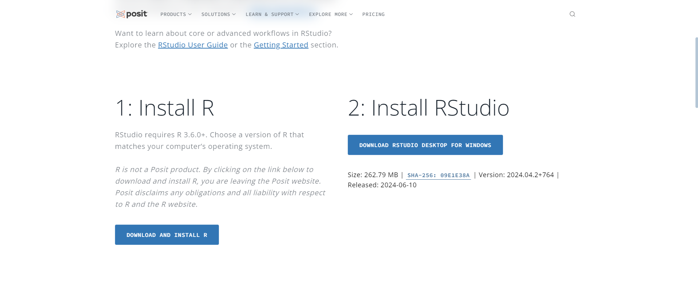

# Практическая работа 0

Подготовка воспроизводимых отчетов

## Цель работы

1.  Подготовить рабочее окружение для работы с Rstudio

2.  Разработать отчет с использованием стека технологий Rmarkdown и
    Quarto

3.  Оформить отчет в соответствии с шаблоном

4.  Создать репозиторий на GitHub и запушить проект

## Исходные данные

1.  Ноутбук

2.  OC Windows

3.  Rstudio

4.  Github

## Варианты решения задачи

Для создания воиспроизводимых отчетов можно использовать использовать
md, rmd или quarto файлы, все варианты дают достаточный функционал для
составления отчетов по выполнению заданий, в данной ЛР будет
использоваться rmd.

## Общий план выполнения

1.  Скачать и установить на ПК R и Rstudio

2.  Создать репозиторий на GitHub

3.  Оформить отчёт

## Содержание ЛР

### Шаг 1

**На данном шаге производится настройка рабочего окружения.**

Для этого необходимо скачать R и RStudio Desktop

<figure>

<figcaption aria-hidden="true"><em>Скачивание R</em></figcaption>
</figure>

<figure>

<figcaption aria-hidden="true"><em>Скачивание RStudio</em></figcaption>
</figure>

Далее происходит установка данного ПО

<figure>

<figcaption aria-hidden="true"><em>Установка R</em></figcaption>
</figure>

<figure>

<figcaption aria-hidden="true"><em>Установка RS</em></figcaption>
</figure>

### Шаг 2

**На данном шаге происходит проверка работоспособности R studio**

``` r
init <- 'Let\'s start!' 
hello
```

    [1] "Let's start!"

### Шаг 3

**На данном шаге происходит создание репозитория на gitHub и загрузка
изменений**

На сайте gitHub был создан репозиторий, для хранения практических работ

<figure>

<figcaption aria-hidden="true"><em>Создание репозитория на
GitHub</em></figcaption>
</figure>

После этого происходит сохранение изменений (commit) и отправка
изменений в удаленный репозиторий (push)

<figure>

</figure>

<figure>

<figcaption aria-hidden="true"><em>Сохранение
изменений</em></figcaption>
</figure>

<figure>

<figcaption aria-hidden="true"><em>Отправка изменений</em></figcaption>
</figure>

<figure>

<figcaption aria-hidden="true"><em>Внесены изменения</em></figcaption>
</figure>

## Оценка результатов

1.  Была подготовлена и настроена для работы среда RStudio

2.  Удалось познакомиться с методом составления отчета с помощью
    Rmarkdown

3.  Была произведена работа с языком R, знакомство с основами данного
    языка и особенностями

4.  Работа успешно загружена в репозиторий GitHub

## Вывод

По итогу данной работы был изучен синтаксис qmd, сформирован отчет,
создан репозиторий в GitHub и настроено рабочее окружение

